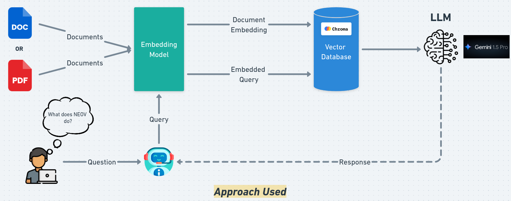

## Objectif: 
Build an AI-powered Q&A system (RAG system) that can answer user questions based on a given set of documents.

## Features & Completed Tasks
- **Document Ingestion**: Supports text files and PDFs (Uses `PyPDFLoader` & `TextLoader` from `langchain_community.document_loaders`).
- **Text Embedding**: Utilizes **Google's `text-embedding-004` model** for document embeddings.
- **Vector Storage**: Employs **`ChromaDB`** for efficient vector storage and retrieval.
- **Retrieval & LLM**: Uses **`similarity` search** for document retrieval and `gemini-1.5-pro` as the LLM.

## Tech Stack
* Python 3.10
* LangChain (for document processing & retrieval)
* ChromaDB (for vector storage)
* Google Generative AI (Gemini-1.5-Pro)



## Setup Guide
Jupyter code is available in the`neov-technical-test.ipynb` file, or you can use the python code in the `main.py` file by following these steps:
### Step 1: Prepare the Environment
Run the following commands to set up your environment:

#### First-time Setup 
```sh
conda create -n nveo_test python=3.10
conda activate nveo_test
pip3 install langchain-core langchain-community langchain-chroma langchain-google-genai pypdf dotenv
pip3 freeze > requirements.txt
```
#### Quick Installation (For You)
To use this code u should just run the commands
```sh
conda create -n nveo_test python=3.10
conda activate nveo_test
pip3 install -r requirements.txt
```

## Step 2: Configuration
Get Google API key from [AI Studio](https://aistudio.google.com/prompts/new_chat)
Create .env file in the project root:
```sh
echo "GEMINI_API_TOKEN=your_api_key_here" > .env
```

## Step 3: Run the system
```py
python3 main.py  # For macOS/Linux
python main.py   # For Windows
```

## Step 4: Customization 
### Specify Document Path
Modify the `ingest_documents` function to change the document path:

```py
vectorstore = embed_documents(ingest_documents("your_document_path"))
```
### Change Embedding Model (Optional)
```py
embeddings = GoogleGenerativeAIEmbeddings(
    model="models/text-embedding-004"  # Try other variants
)
```

### Retrieval Parameters (Optional)
```py 
vectorstore.as_retriever(
    search_type="similarity",
    search_kwargs={"k": 8} # Adjust "k" for more/less retrieved documents
)
```

### Generation Settings (Optional)
```py
ChatGoogleGenerativeAI(
    model="gemini-1.5-pro",
    temperature=0.3,  # Lower for factual responses, higher for creativity (Range: 0-1)
    max_tokens=500    # Adjust based on response length needs
)
```